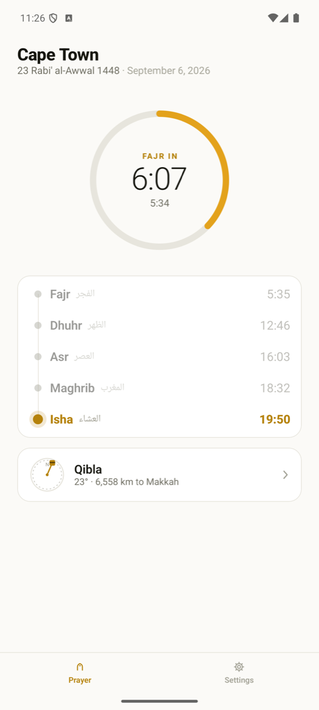
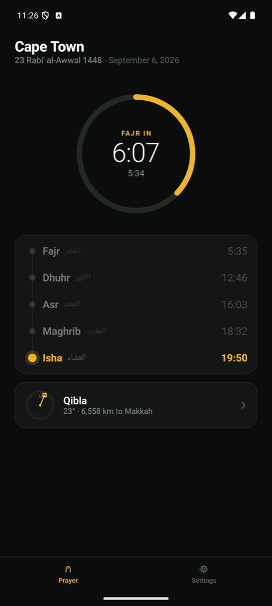
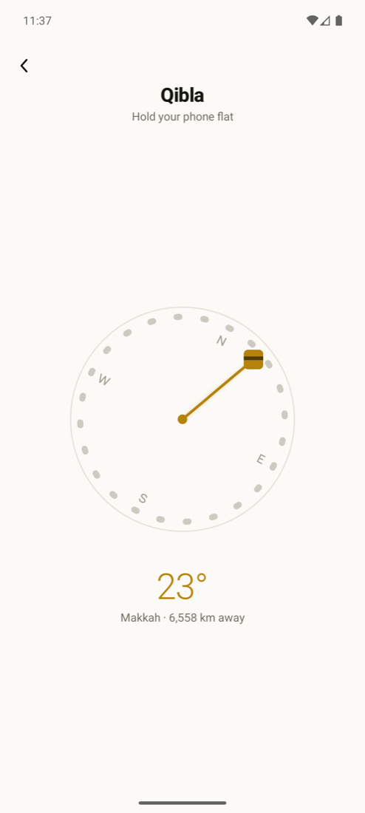
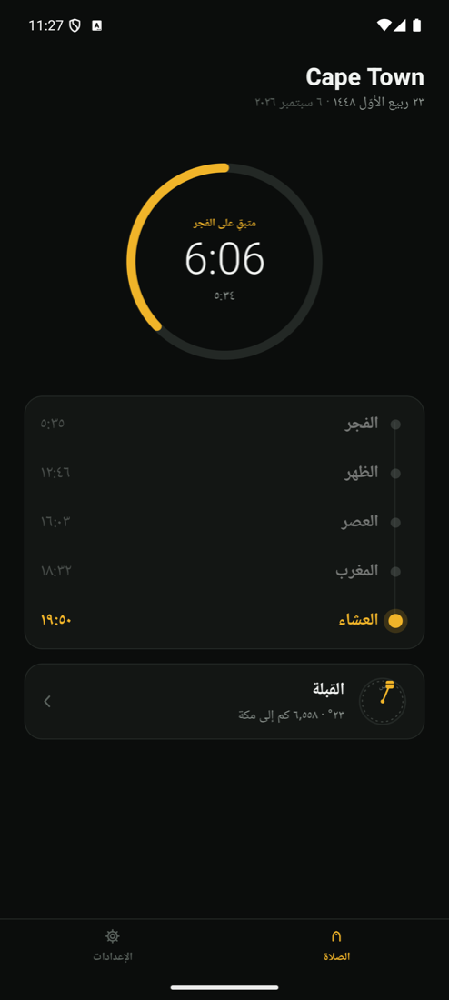
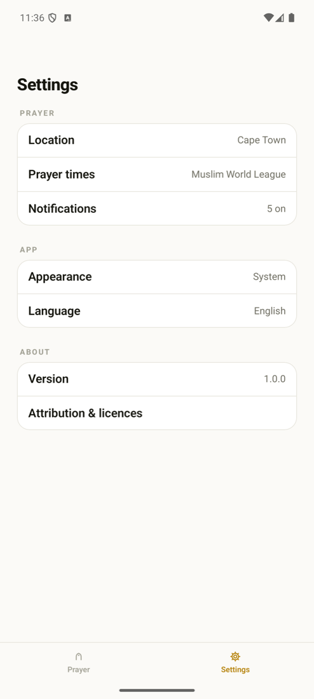
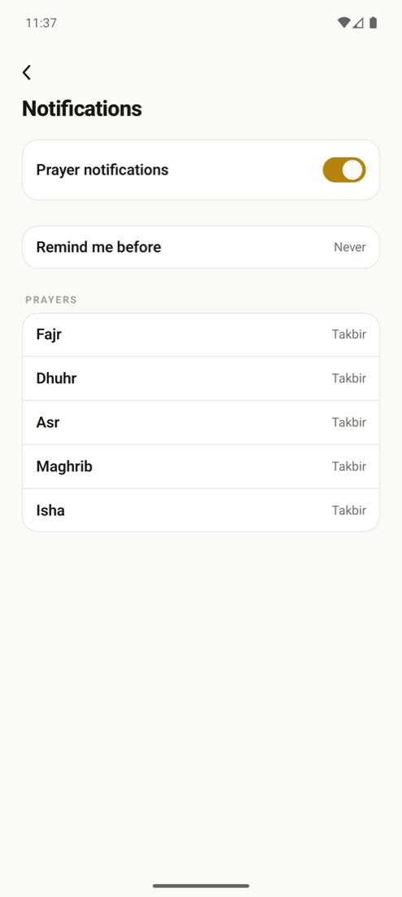
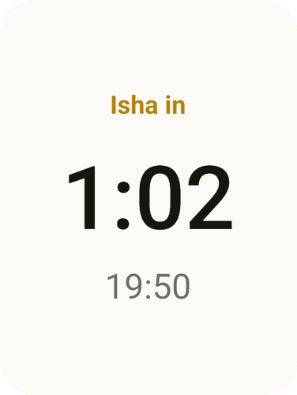
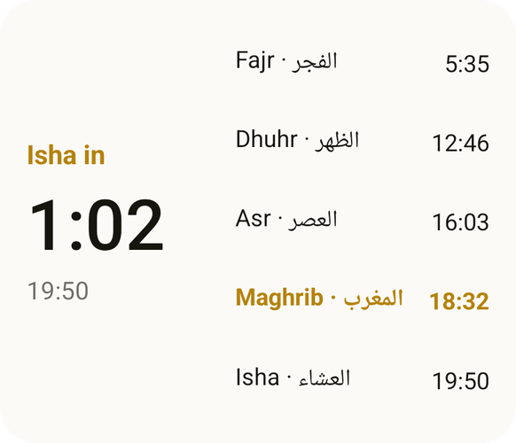

<p align="center">
  
</p>

<h1 align="center">Taqwa</h1>

<p align="center">
  Prayer times, adhan notifications and qibla.<br>
  Free, offline, no ads, no accounts, no tracking.
</p>

<p align="center">
  
  
  
  
  
</p>

<p align="center">
  
  &nbsp;
  
  &nbsp;
  
  &nbsp;
  
</p>

---

Taqwa is a small Islamic app for Android and iPhone, built from one Kotlin Multiplatform codebase. It does a few things and tries to do them properly: tell you the prayer times where you are, call you to them, point you to Makkah, and stay out of your way. Everything is computed on the phone. There is no server, no sign-in, no analytics and nothing to pay for, now or later.

## What it does

- **Prayer times** for anywhere on Earth, from GPS or a bundled offline database of cities, with the usual calculation methods (Muslim World League, Umm al-Qura, Egyptian, Karachi, ISNA, and more), Hanafi or Standard Asr, high-latitude rules, and per-prayer manual adjustments.
- **A live countdown** to the next prayer, on the Prayer screen and in home-screen widgets on both platforms. The widgets keep counting across prayers without the app being opened.
- **Notifications at the exact time**, with a choice per prayer between silence, Taqwa's own short chime, a takbir, or the opening of the adhan. Optional reminder a few minutes before.
- **Qibla compass** corrected to true north, with the great-circle distance to Makkah and honest calibration guidance when the compass needs it.
- **Hijri date** (Umm al-Qura tabular calendar) with a one-day adjustment for local moonsighting, shown beside the Gregorian date.
- **Arabic and English**, following the phone's language. Arabic is laid out right to left with the locale's own digits, not translated over an English layout.
- **Light and dark**, following the system or fixed, in one amber accent.

## Principles

- **Zero recurring cost.** Nothing in the app contacts a server. This is a hard constraint on every feature, not a preference.
- **Offline first.** Prayer times and qibla are mathematics; the city database ships inside the app.
- **Nothing to sell.** No ads, no premium tier, no data collection, no account.
- **One design, both platforms.** The same Compose UI on Android and iOS, with native widgets, notifications, sensors and location behind small `expect`/`actual` seams.
- **Arabic is first-class.** Names, dates, digits and layout direction are all locale-driven.

## More screens

<p align="center">
  
  &nbsp;
  
  &nbsp;
  
  &nbsp;
  
</p>

## Roadmap

Taqwa is being built in slices. Each slice ships as a complete, usable app.

| Slice | Scope | Status |
|---|---|---|
| 1 | Prayer times, notifications, qibla, widgets, settings, Arabic | **Done**, in device testing |
| 2 | Quran reader: Arabic text with translations beneath, bundled offline | Next |
| 3 | Quran audio: recitations, per-ayah playback | Planned |
| 4 | Dhikr: morning and evening adhkar, tasbih, khatm plan | Planned |

Deliberately out of scope: mosque finder, zakat calculator, hadith collections, community features, anything that needs a server.

## Building

**Requirements**

- JDK 21 (Android Studio's bundled JetBrains Runtime is fine)
- Android Studio with the Android SDK, `compileSdk` 37
- Xcode 26 for iOS builds and the iOS test targets
- macOS for anything iOS; Android builds work on any OS

**Android**

```bash
./gradlew :androidApp:installDebug
```

**iOS**

Open `iosApp/iosApp.xcodeproj` in Xcode and run the `iosApp` scheme, or from the terminal:

```bash
./scripts/ios-build.sh
```

The script builds for the simulator and checks the widget extension stays under its memory budget. Signing for a physical device needs your own team in Xcode.

**Tests**

```bash
./scripts/test.sh
```

Runs the shared and widget test suites on the JVM and on the iOS simulator. All the domain logic (prayer times, qibla, Hijri conversion, notification planning, widget content) lives in `commonMain` and is tested there without a device.

## Project layout

```
shared/       Compose UI, domain logic, view models, expect/actual platform seams
widgetcore/   Compose-free widget model, linked by the iOS widget extension
androidApp/   Android entry point, Glance widgets, alarm and boot receivers
iosApp/       iOS entry point (SwiftUI shell), WidgetKit extension
assets/       Source audio and generators for the bundled sounds
docs/         Design spec, implementation plans, build log, attribution
scripts/      Test and build helpers (they pin the Xcode 26 toolchain)
tools/        City database builder and Xcode project helpers
```

The design spec that the app is built from is in [`docs/superpowers/specs`](docs/superpowers/specs), and [`docs/BUILD-LOG.md`](docs/BUILD-LOG.md) is the narrative of every iteration since, including what was found on real devices and why things are the way they are.

## Contributing

Contributions are welcome, from a typo in the Arabic strings to a new calculation method.

1. **Open an issue first** for anything beyond a small fix, so the approach can be agreed before you spend time on it. Bug reports are most useful with the device, OS version, language, and a screenshot.
2. **Fork and branch** from `main`.
3. **Keep the constraints.** No network calls, no third-party SDKs that phone home, no new colour outside the palette in `Palette.kt`, and Arabic must be checked as carefully as English. If a change touches the UI, include screenshots of both languages and both themes.
4. **Run `./scripts/test.sh`** and add tests for domain logic. Prayer-time and qibla changes need known-answer tests against published values.
5. **Open a pull request** (merge request) against `main` describing what changed and why. Small, focused PRs are reviewed quickly; large ones are split.

Translations: the two string files are `shared/src/commonMain/composeResources/values/strings.xml` and `values-ar/strings.xml`. New languages are welcome as long as every string is covered.

## Privacy

Taqwa asks for your location only to compute prayer times and the qibla, and only if you choose to allow it; picking a city from the built-in list works just as well. Location never leaves the phone. There are no analytics, no crash reporters and no network access of any kind.

## Attribution

Prayer-time mathematics by [Adhan](https://github.com/batoulapps/adhan-kotlin) (MIT), city data from [GeoNames](https://www.geonames.org/) (CC BY 4.0), the Manrope typeface (SIL OFL 1.1), and the adhan and takbir recordings from Wikimedia Commons (CC0). Full details in [`docs/ATTRIBUTION.md`](docs/ATTRIBUTION.md) and in the app under Settings, Attribution & licences.

## Licence

The licence for the code is being decided before the first public release. Until a `LICENSE` file lands, please treat the code as all rights reserved and open an issue if you want to use it in something of your own.
