<p align="center">
  
</p>

<h1 align="center">Taqwa</h1>

<p align="center">
  Prayer times, Qibla and the Quran.<br>
  Free forever. No ads, no account, offline by design.
</p>

<p align="center">
  <a href="https://taqwa.world">taqwa.world</a> ·
  <a href="https://taqwa.world/ar/">العربية</a> ·
  <a href="PRIVACY.md">Privacy</a> ·
  <a href="https://taqwa.world/support/">Support</a>
</p>

<p align="center">
  
  
  
  
  
  
</p>

<p align="center">
  
  &nbsp;
  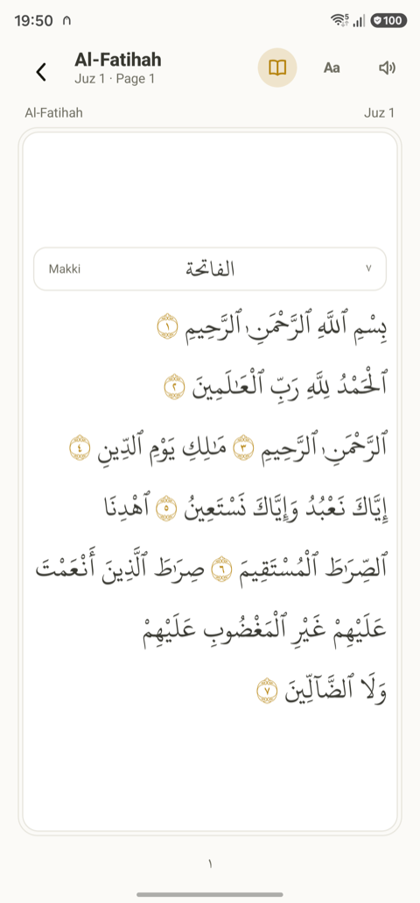
  &nbsp;
  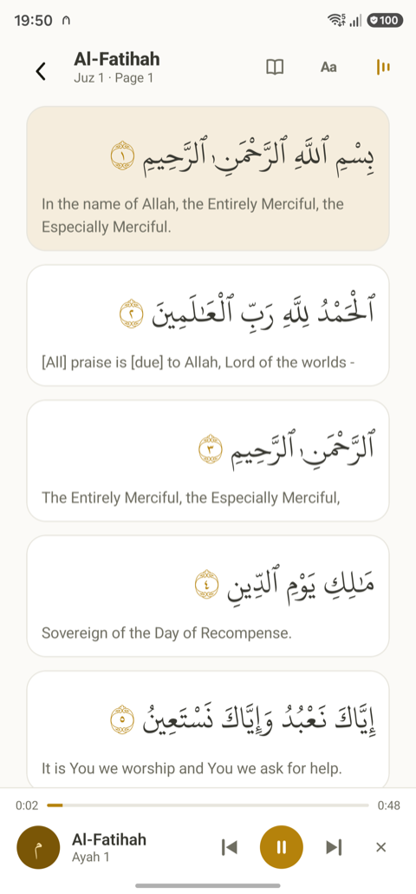
  &nbsp;
  
</p>

---

Taqwa is an Islamic app for Android and iPhone, built from one Kotlin Multiplatform codebase. It does a few things and tries to do them properly: tell you the prayer times where you are, call you to them, point you to Makkah, and carry the Quran with recitation. Everything is computed on the phone. There is no server, no sign-in, no analytics and nothing to pay for, now or later.

## What it does

- **Prayer times** for anywhere on Earth, from your location or a bundled offline database of cities, with the usual calculation methods (Muslim World League, Umm al-Qura, Egyptian, Karachi, ISNA, and more), Hanafi or Standard Asr, high-latitude rules, and per-prayer manual adjustments.
- **A live countdown** to the next prayer, on the Prayer screen and in home-screen widgets on both platforms. The widgets keep counting across prayers without the app being opened.
- **Adhan at the exact time.** A notification for each prayer, with a choice per prayer between silence, a clear tone, a takbir, or the opening of the adhan in a choice of three voices. Optional reminder a few minutes before.
- **Qibla compass** corrected to true north, with the great-circle distance to Makkah and honest calibration guidance when the phone's compass needs it, instead of a needle that pretends.
- **Hijri date** from the tabular (arithmetic) Islamic calendar, which can differ by a day from Umm al-Qura and from local moonsighting, with a one-day adjustment to match your community; shown beside the Gregorian date.
- **The Quran** with the Uthmani text in the Madinah Mushaf typeface, seven translations and a transliteration, a page-accurate Mushaf mode, search in Arabic or in the chosen translation, bookmarks, a continue-reading card, and copy or share of any ayah. All of it offline.
- **Recitation** by ten reciters, downloaded a surah at a time (or the whole Quran for a reciter) and then played offline with the ayah lit and the page following the voice, in the background with lock-screen controls and a surah clock. A speaker button in the reader, a Play action on any ayah, previous and next by surah, and a picker with a fifteen-second preview of each voice.
- **Tasbeeh.** A dhikr counter behind the misbaha icon on the Prayer screen: tap anywhere to count, the post-prayer set runs to a hundred with the dhikr changing at each part and a distinct pulse in the hand, a completed set rolls over on its own, your own phrases can be added, and nothing is ever totted up.
- **An ayah widget** showing one verse a day, in the same Uthmani typeface and translation as the reader, from a curated pool of a hundred that cycles without repeats. Tapping it opens that ayah in the app.
- **Privacy you can check.** Settings › About Taqwa says what stays on the phone and what the internet is used for, and links the website, the policy, the source and the licence. If the app ever closes unexpectedly, it keeps a technical report on the phone and offers, once, to email it to support; nothing is sent unless you choose to.
- **Seven languages.** Arabic, English, French, Turkish, Indonesian, Urdu and Bengali, following the phone's language or a per-app choice. Arabic and Urdu are laid out right to left with the locale's own digits, not translated over an English layout; Bengali keeps its own digits too.
- **Light and dark**, following the system or fixed, in one amber accent.

## On your home screen

<p align="center">
  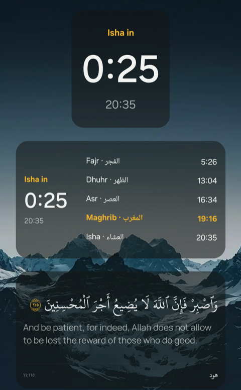
</p>

Three widgets, on Android and iOS: a **small** one with the next prayer and a live countdown, a **medium** one that adds the day's five times, and the **ayah of the day** in the reader's own typeface with its translation. They update on their own, all day, without the app being opened, and their background can follow the system, stay light or dark, or blend into the wallpaper as above. Tapping a prayer widget opens the Prayer screen; tapping the ayah opens that verse in the reader.

## More screens

<p align="center">
  
  &nbsp;
  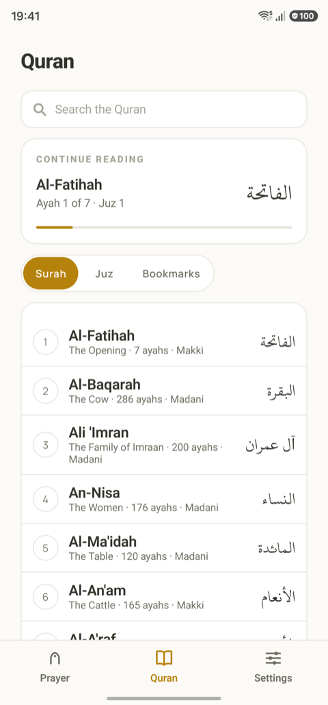
  &nbsp;
  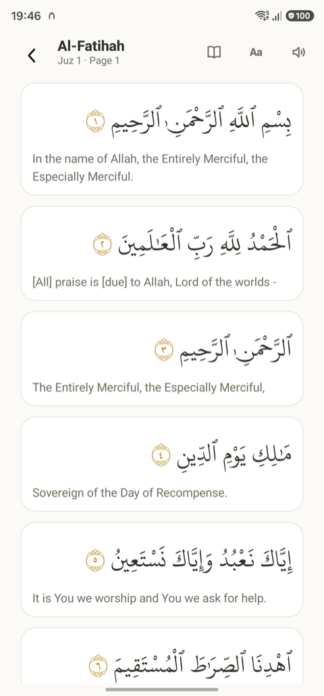
  &nbsp;
  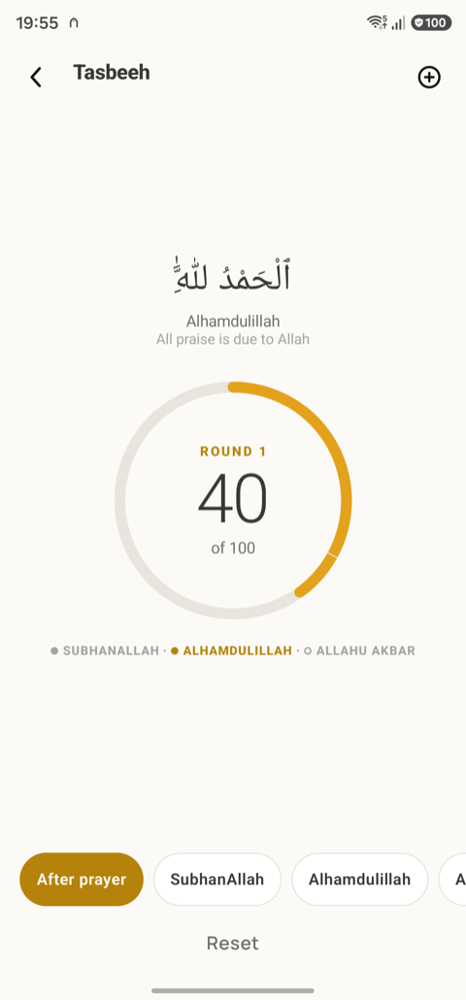
</p>

<p align="center">
  
  &nbsp;
  
  &nbsp;
  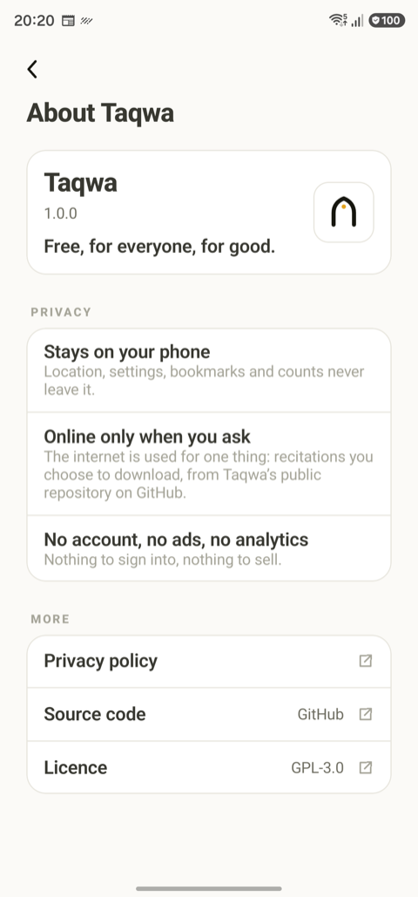
  &nbsp;
  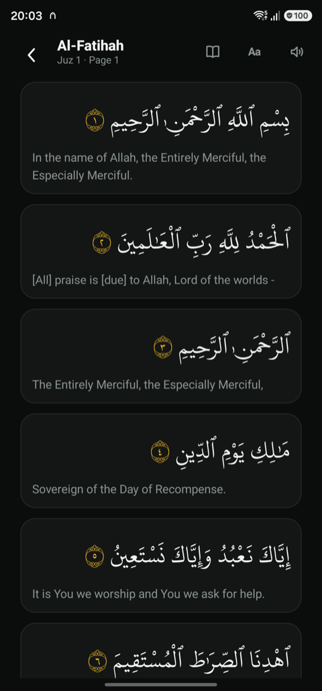
</p>

<p align="center">
  
  &nbsp;
  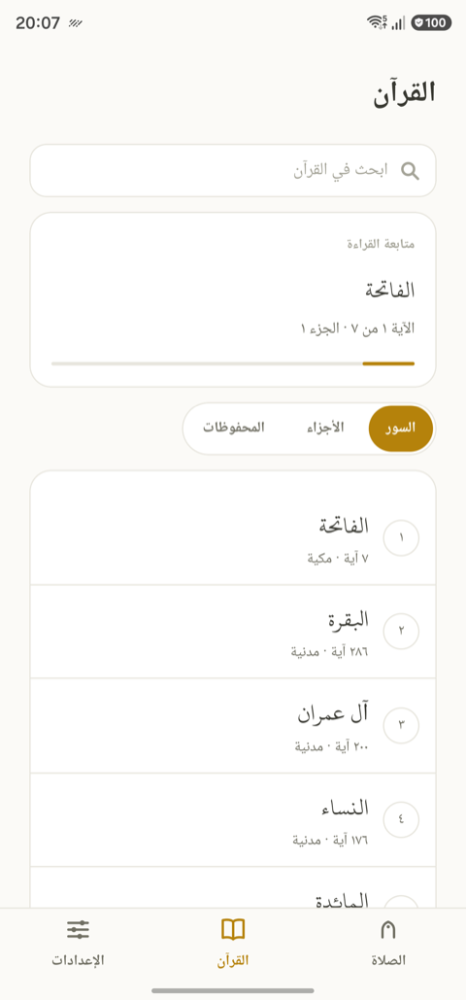
  &nbsp;
  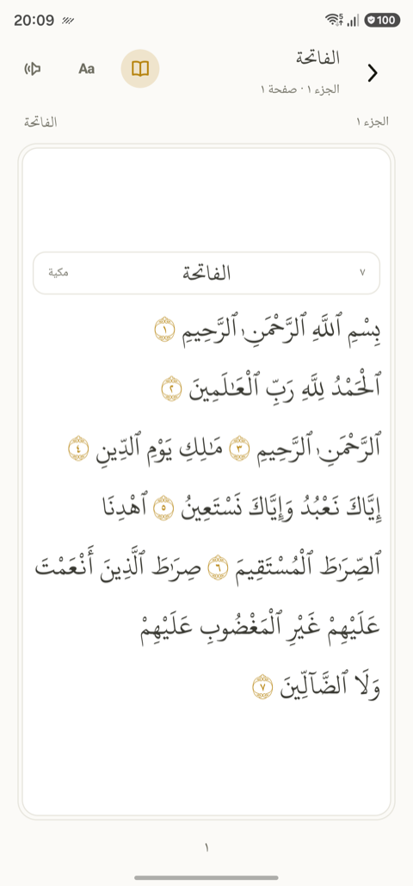
  &nbsp;
  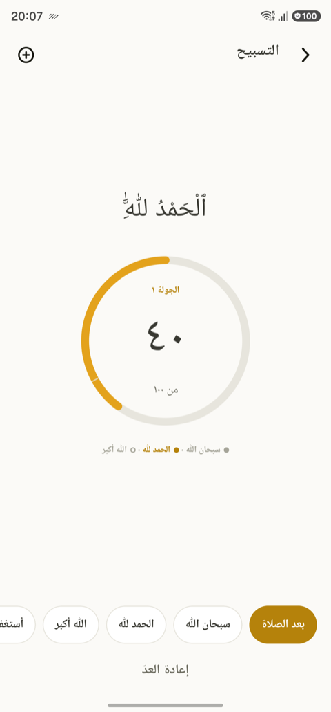
</p>

All screenshots are from a Samsung Galaxy S23 Ultra running the current build.

## Principles

- **Zero recurring cost.** Nothing in the app contacts a server of ours; there is none. The only network use is recitation downloads from a public GitHub repository, on request. This is a hard constraint on every feature, not a preference.
- **Offline first.** Prayer times and Qibla are mathematics; the city database and the Quran ship inside the app; recitations are downloaded once and kept.
- **Your language, including the map.** The bundled city list carries names in Arabic, Indonesian, Urdu, Bengali, Turkish and French as well as English, so a city can be searched and read in either its own language or English, and the Prayer header follows the phone.
- **Nothing to sell.** No ads, no premium tier, no data collection, no account.
- **One design, both platforms.** The same Compose UI on Android and iOS, with native widgets, notifications, sensors, audio and location behind small `expect`/`actual` seams.
- **Arabic is first-class.** Names, dates, digits and layout direction are all locale-driven.

## Get it

Taqwa is coming to Google Play and the App Store. Until then it can be built from source (below), and the website at [taqwa.world](https://taqwa.world) will carry the store links the day they exist.

## Roadmap

Taqwa is built in slices. Each slice ships as a complete, usable app.

| Slice | Scope | Status |
|---|---|---|
| 1 | Prayer times, notifications, Qibla, widgets, settings, Arabic | **Done** |
| 2 | Quran reader: Arabic text with translations, Mushaf mode, search, bookmarks, share; bundled offline | **Done** |
| 3 | Quran audio: ten reciters, per-surah downloads, background playback with the page following | **Done** |
| 4 | Dhikr: tasbeeh counter | **Done** |

Deliberately out of scope: mosque finder, zakat calculator, hadith collections, community features, anything that needs a server.

## Building

**Requirements**

- JDK 21 (Android Studio's bundled JetBrains Runtime is fine)
- Android Studio with the Android SDK, `compileSdk` 37
- Xcode 26 for iOS builds and the iOS test targets
- macOS for anything iOS; Android builds work on any OS

**Android**

```bash
./gradlew :androidApp:installDebug
```

**iOS**

Open `iosApp/iosApp.xcodeproj` in Xcode and run the `iosApp` scheme, or from the terminal:

```bash
./scripts/ios-build.sh
```

The script builds for the simulator and checks the widget extension stays under its memory budget. Signing for a physical device needs your own team in Xcode.

**Tests**

```bash
./scripts/test.sh
```

Runs the shared and widget test suites on the JVM and on the iOS simulator. All the domain logic (prayer times, Qibla, Hijri conversion, notification planning, widget content, the recitation library and downloader) lives in `commonMain` and is tested there without a device. `scripts/check-strings.sh` checks that the English and Arabic string files carry the same keys.

**Website**

The site at taqwa.world lives in `site/` and is built by `site/build.py` from the page fragments under `site/pages/<lang>/` and the seven policy files at the repository root; a GitHub Pages workflow deploys it on every push that touches it. Email addresses on the site are wrapped in Cloudflare's `email_off` comments so they are never rewritten into `[email protected]` on the way to a reader.

## Project layout

```
shared/       Compose UI, domain logic, view models, expect/actual platform seams
widgetcore/   Compose-free widget model, linked by the iOS widget extension
androidApp/   Android entry point, Glance widgets, alarm and boot receivers, the recitation service
iosApp/       iOS entry point (SwiftUI shell), WidgetKit extension
site/         The website in seven languages, built by site/build.py
assets/       Source audio and generators for the bundled sounds
docs/         Design specs, implementation plans, build log, attribution, store answers
scripts/      Test and build helpers
tools/        City database builder, Quran database pipeline, the recitation audio pipeline
```

The design specs the app is built from are in [`docs/superpowers/specs`](docs/superpowers/specs), and [`docs/BUILD-LOG.md`](docs/BUILD-LOG.md) is the narrative of every iteration since, including what was found on real devices and why things are the way they are.

## Contributing

Contributions are welcome, from a typo in the Arabic strings to a new calculation method.

1. **Open an issue first** for anything beyond a small fix, so the approach can be agreed before you spend time on it. Bug reports are most useful with the device, OS version, language, and a screenshot; without a GitHub account, email support@taqwa.world instead.
2. **Fork and branch** from `main`.
3. **Keep the constraints.** No network calls beyond the recitation downloads the person asked for, no third-party SDKs that phone home, no new colour outside the palette in `Palette.kt`, and every language must be checked as carefully as English, the right-to-left ones (Arabic, Urdu) especially. If a change touches the UI, include screenshots of English and Arabic in both themes.
4. **Run `./scripts/test.sh`** and add tests for domain logic. Prayer-time and Qibla changes need known-answer tests against published values.
5. **Open a pull request** against `main` describing what changed and why. Small, focused PRs are reviewed quickly; large ones are split.

Translations: one `strings.xml` per language under `shared/src/commonMain/composeResources/` (`values/` for English, then `values-ar`, `values-fr`, `values-tr`, `values-in`, `values-ur`, `values-bn`), and `scripts/check-strings.sh` checks that every file carries the same keys. New languages are welcome as long as every string is covered, and the website and privacy policy should follow in the same language.

## Privacy

Taqwa asks for your location only to compute prayer times and the Qibla, and only if you choose to allow it; picking a city from the built-in list works just as well. Location never leaves the phone. The app makes no network request until you use Quran recitation. Recitations are downloaded one surah at a time from Taqwa's public data repository on GitHub, only when you ask; that request shows GitHub your IP address and the file you asked for, and nothing else. There are no analytics, no crash-reporting SDKs and no third-party SDKs that talk to the internet; if the app crashes it keeps a report on the phone and only ever emails it when you choose to. Full policy in [PRIVACY.md](PRIVACY.md), also in [Arabic](PRIVACY.ar.md), [French](PRIVACY.fr.md), [Turkish](PRIVACY.tr.md), [Indonesian](PRIVACY.id.md), [Urdu](PRIVACY.ur.md) and [Bengali](PRIVACY.bn.md), and on the website at [taqwa.world/privacy](https://taqwa.world/privacy/). Questions go to support@taqwa.world.

## Attribution

Prayer-time mathematics by [Adhan](https://github.com/batoulapps/adhan-kotlin) (MIT), city data from [GeoNames](https://www.geonames.org/) (CC BY 4.0), the Manrope typeface (SIL OFL 1.1), and three adhan and takbir recordings from Wikimedia Commons — "Beautiful adhan" by Adam-synagda (CC0), "The Adhan – Muslim Call to Prayer – Aaqib Azeez" (CC BY-SA 4.0) and "Eid al-Fitr Fajr azan at Malmö Mosque" by Islamic Center Malmö (CC BY 3.0). The Quran text and its translations are from the [Tanzil Project](https://tanzil.net), the reading font is KFGQPC Uthmanic Script Hafs from the King Fahd Glorious Quran Printing Complex, and the Mushaf page layout comes from the Quranic Universal Library data. The recitations are the [Islamic Network](https://alquran.cloud) per-ayah recordings, licensed to them by the reciters for free, non-commercial redistribution at the bitrates they publish and mirrored unmodified — Alafasy, Abdul Basit, Maher Al Muaiqly, Al-Husary, Al-Minshawi, As-Sudais, Ash-Shuraim, Ash-Shatri, Al-Hudhaify and Al-Ajmi, each credited by name in the app. Full details in [`docs/ATTRIBUTION.md`](docs/ATTRIBUTION.md) and in the app under Settings › Attribution & licences.

## Licence

Taqwa is free software under the [GNU General Public License v3.0](LICENSE). You may use, study, share and modify it, and anything you distribute that is built from it must stay under the same licence with its source available. That is deliberate: it keeps a free, ad-free app from being repackaged as neither. The bundled Quran text, translations, typefaces, city data and audio are third-party works under their own licences, not the GPL, listed above and in the app; see [NOTICE](NOTICE) and [docs/ATTRIBUTION.md](docs/ATTRIBUTION.md).

Copyright © 2026 Mohamed Abulgasem.
